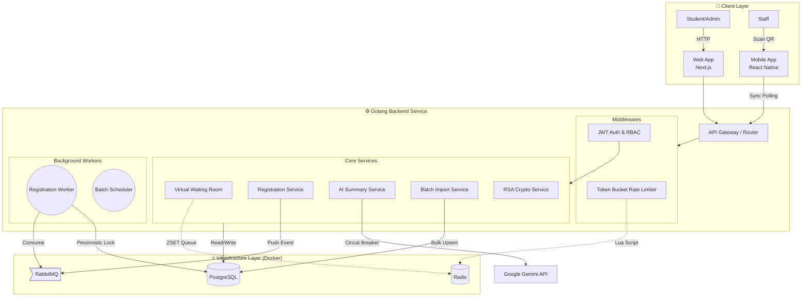

# 1. System Architecture Blueprint

Tài liệu mô tả kiến trúc tổng thể của hệ thống UniHub Workshop Management System, phản ánh chính xác cấu trúc Backend (Go), Web (Next.js) và Mobile (Expo/React Native).

## 1.1 Sơ Đồ Kiến Trúc Hệ Thống (Mermaid)

## 1.2 Thành Phần Hệ Thống (System Components)

### A. Client Layer
1. **Web Admin / Student (Next.js):** Xử lý giao diện cho sinh viên đăng ký sự kiện và Admin tạo workshop, tải lên danh sách CSV.
2. **Mobile Scanner (Expo):** Ứng dụng dành cho Staff quét vé QR tại hội trường. Khả năng hoạt động **Offline-first**, sử dụng SQLite cục bộ lưu check-in và đẩy ngầm lên server khi có mạng.

### B. Gateway & Middleware
1. **Rate Limiting:** Sử dụng thuật toán Token Bucket cài đặt qua Redis Lua Script, giới hạn truy cập theo User/IP để chống DDoS (Cấu hình: 5000 tokens, refill 1000 tokens/s).
2. **JWT Authentication:** Định danh người dùng không trạng thái (Stateless).
3. **Virtual Waiting Room (Redis ZSET):** Đệm lưu lượng khi lượng người truy cập đăng ký quá đông. Ngăn không cho connection dội thẳng vào DB.

### C. Processing Core (Golang Services)
1. **Event-Driven Registration:** Thay vì đăng ký đồng bộ, API sẽ bắn yêu cầu vào RabbitMQ và trả về `202 Accepted`. Background Worker lấy yêu cầu và xử lý trừ chỗ ngồi.
2. **AI Summary (Pipe-and-Filter):** Dịch vụ trích xuất PDF -> Clean Text -> Gọi Gemini AI qua Circuit Breaker -> Trả về tóm tắt.
3. **Batch Data Import:** Xử lý file CSV 12,000 học sinh cực nhanh bằng cơ chế chunking và `INSERT ... ON CONFLICT DO UPDATE` của Postgres.

### D. Data Layer
1. **PostgreSQL:** CSDL chính, đảm bảo ACID, sử dụng khoá bi quan (Pessimistic Lock) khi xử lý vé.
2. **Redis:** Lưu cache phòng chờ, token rate limit và cờ Idempotency (chống click đúp).
3. **RabbitMQ:** Hàng đợi lưu trữ an toàn các sự kiện đăng ký.
