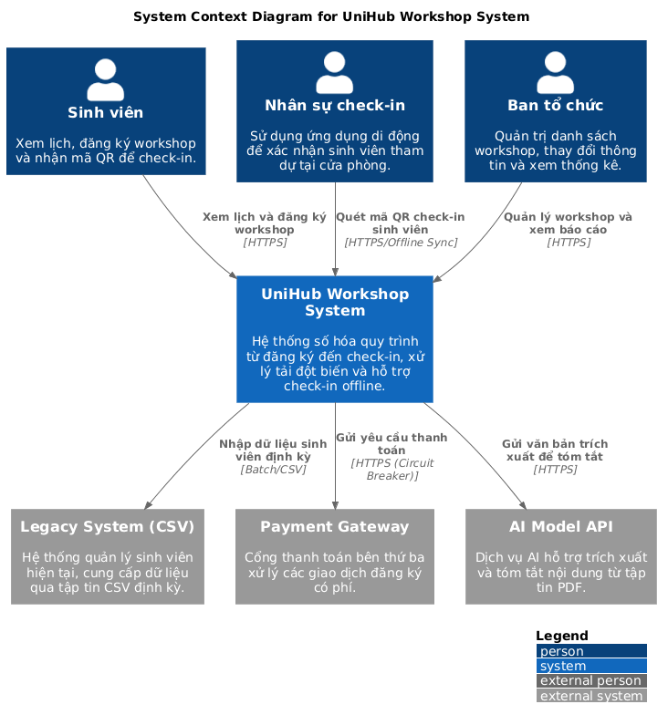
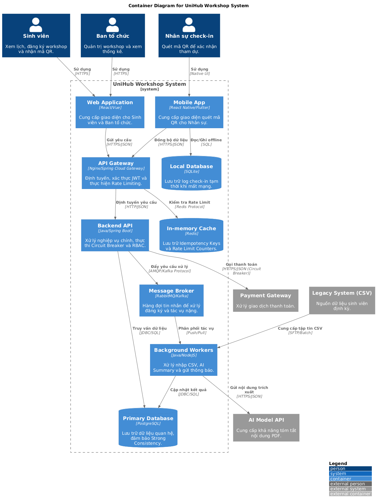
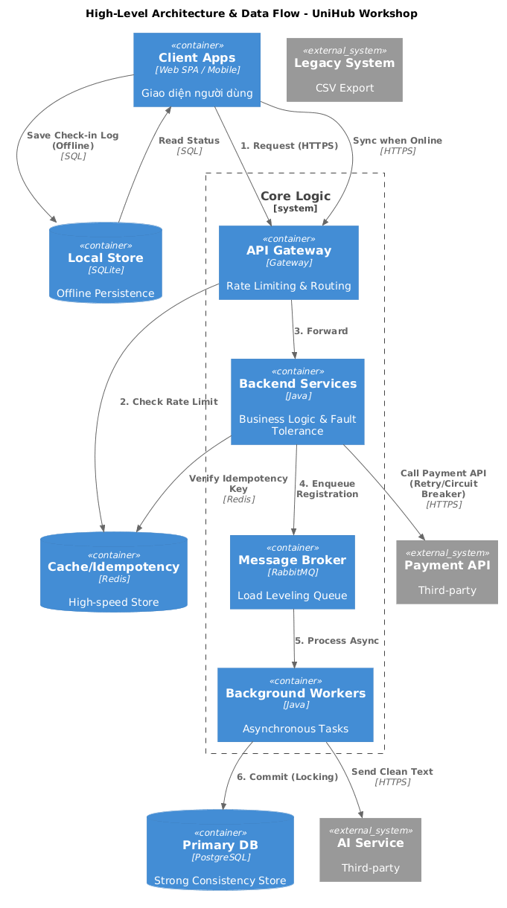

# UniHub Workshop - Technical Design

## 1. Architectural Styles
Hệ thống sử dụng mô hình kiến trúc hỗn hợp nhằm tối ưu hóa các đặc tính hệ thống khác nhau:

* **Layered Architecture:** Tổ chức mã nguồn backend thành các tầng Presentation, Business Logic và Data Access. Cấu trúc này đảm bảo tính phân tách trách nhiệm và hỗ trợ Unit Testing hiệu quả.
* **Event-Driven Architecture:** Sử dụng Message Broker để xử lý các yêu cầu đăng ký workshop. Kiến trúc này giúp Load Leveling khi xảy ra tải đột biến, đảm bảo tính Decoupling giữa API tiếp nhận và Service xử lý nghiệp vụ.
* **Pipe-and-Filter:** Áp dụng cho module AI Summary. Luồng dữ liệu đi qua chuỗi các Filter: PDF Extraction -> Data Cleaning -> AI Prompt Construction -> Result Persistence.
* **Batch Sequential:** Thực hiện tiến trình đồng bộ dữ liệu sinh viên từ hệ thống cũ qua tập tin CSV vào ban đêm. Mỗi bước trong quy trình phải hoàn thành 100% trước khi chuyển sang giai đoạn tiếp theo để đảm bảo Data Integrity.

## 2. C4 Model Diagrams
### 2.1. Level 1: System Context
Sơ đồ mô tả UniHub Workshop trong mối tương quan với các Actor (Sinh viên, Ban tổ chức, Nhân sự check-in) và các External Systems (Hệ thống quản lý sinh viên cũ, Payment Gateway, AI Model).

<figure>
  
  <figcaption align="center">Hình 1. Sơ đồ System Context - Tổng quan tương tác hệ thống UniHub</figcaption>
</figure>

### 2.2. Level 2: Container
Hệ thống được phân rã thành các đơn vị phân phối và vận hành độc lập:
* **Web Application (SPA):** Giao diện tương tác người dùng trên trình duyệt, xử lý luồng đăng ký cho Sinh viên và quản trị cho Ban tổ chức.
* **Mobile App:** Ứng dụng di động chuyên dụng cho nhân sự check-in, tích hợp khả năng quét mã QR và lưu trữ cục bộ.
* **SQLite (Local DB):** Cơ sở dữ liệu nhúng tại Mobile App, đảm bảo Offline Persistence cho nghiệp vụ check-in khi mất kết nối mạng.
* **API Gateway:** Điểm tiếp nhận tập trung, thực hiện định tuyến yêu cầu, xác thực Stateless (JWT) và kiểm soát tải đột biến (Rate Limiting).
* **Backend API:** Thành phần xử lý logic nghiệp vụ lõi, thực thi các nguyên lý SOLID và đảm bảo khả năng chịu lỗi qua Circuit Breaker.
* **Message Broker:** Hệ thống trung gian (RabbitMQ/Kafka) điều hòa lưu lượng, hỗ trợ kiến trúc hướng sự kiện và xử lý bất đồng bộ.
* **Background Workers:** Các tiến trình xử lý tác vụ tiêu tốn tài nguyên như Batch Import dữ liệu CSV, AI Summary và Notification Service.
* **Relational Database (PostgreSQL):** Hệ quản trị cơ sở dữ liệu chính, thực thi Pessimistic Locking để đảm bảo Strong Consistency cho luồng đăng ký.
* **In-memory Cache (Redis):** Lưu trữ Idempotency Keys để chống trùng lặp giao dịch và hỗ trợ thuật toán Token Bucket cho Rate Limiting.

<figure>
  
  <figcaption align="center">Hình 2. Sơ đồ Container - Phân rã kỹ thuật và luồng giao tiếp nội bộ hệ thống UniHub Workshop</figcaption>
</figure>

## 2.3. High-Level Architecture Diagram
Sơ đồ này mô tả chi tiết luồng dữ liệu giữa các thành phần, nhấn mạnh vào các điểm tích hợp hệ thống ngoài và cơ chế xử lý dữ liệu đặc thù.

<figure>
  
  <figcaption align="center">Hình 3. Sơ đồ luồng dữ liệu và tích hợp hệ thống (High-Level Architecture)</figcaption>
</figure>

### Các luồng dữ liệu cốt lõi:
1. **Luồng Đăng ký tải cao (Event-Driven):** Request từ Sinh viên đi qua API Gateway để kiểm tra Rate Limit tại Redis. Sau khi xác thực, yêu cầu được đẩy vào Message Broker để điều hòa tải (Load Leveling), tránh dội trực tiếp vào Database chính. Background Workers sẽ lấy yêu cầu từ hàng đợi và thực hiện ghi dữ liệu vào PostgreSQL dưới cơ chế Pessimistic Locking.
2. **Luồng Thanh toán (Fault Tolerance):** Khi tích hợp với Payment Gateway, hệ thống áp dụng Pattern Circuit Breaker để ngắt kết nối nếu đối tác gặp sự cố kéo dài. Đồng thời, Idempotency Key được lưu trữ tại Redis để đảm bảo tính nhất quán, chống trừ tiền hai lần khi người dùng hoặc hệ thống tự động Retry.
3. **Luồng Check-in Offline (AP Architecture):** Trên thiết bị di động, dữ liệu quét mã QR được lưu trữ bền vững tại SQLite (Offline Persistence). Khi có kết nối mạng trở lại, một tiến trình Background Sync sẽ đẩy dữ liệu về Backend để cập nhật trạng thái vào PostgreSQL, đạt mức Nhất quán cuối cùng (Eventual Consistency).
4. **Luồng AI Summary (Pipe-and-Filter):** Dữ liệu PDF sau khi được tải lên bởi Ban tổ chức sẽ được trích xuất và làm sạch, sau đó truyền qua các Filter xử lý trước khi gửi sang mô hình AI để lấy bản tóm tắt.

## 3. Database Design & Consistency Strategy
Hệ thống triển khai chiến lược Polyglot Persistence dựa trên định lý CAP:

* **PostgreSQL (RDBMS):** Đóng vai trò Source of Truth. Sử dụng để quản lý Workshop, User và Registration. 
    * **Concurrency Control:** Sử dụng Pessimistic Locking (SELECT FOR UPDATE) để xử lý tranh chấp 60 chỗ ngồi, đảm bảo Strong Consistency.
    * **Schema:** Thiết kế chuẩn hóa (Normalization) để duy trì Data Integrity cho các giao dịch tài chính và đăng ký.
* **Redis (In-memory Store):** * **Rate Limiting:** Triển khai thuật toán Token Bucket để kiểm soát tải 12.000 request.
    * **Idempotency:** Lưu trữ Idempotency Keys với cơ chế Time-to-Live (TTL) để ngăn chặn Duplicate Transactions.
* **SQLite (Mobile Side):** * **Offline Persistence:** Lưu trữ dữ liệu check-in cục bộ trên Mobile App.
    * **Synchronization:** Sử dụng cơ chế Background Sync để đạt Eventual Consistency khi thiết bị khôi phục kết nối mạng.

## 4. Access Control Model
Triển khai mô hình Role-Based Access Control (RBAC) kết hợp với JWT:
* **Authentication:** Sử dụng JWT để định danh người dùng qua các Stateless Requests.
* **Authorization:** Middleware kiểm tra Role tại từng API Endpoint. Ban tổ chức nắm quyền CRUD workshop; Nhân sự check-in chỉ được phép thực hiện Scan QR; Sinh viên giới hạn trong quyền Read và Register.

## 5. Fault Tolerance & Resilience
Hệ thống được thiết kế để tự phục hồi và bảo vệ trước các sự cố:

### 5.1. Rate Limiting
Sử dụng thuật toán Token Bucket tại API Gateway. Hệ thống sẽ giới hạn lưu lượng dựa trên MSSV hoặc IP để ngăn chặn tình trạng spam request trong 3 phút đầu mở đăng ký.

### 5.2. Circuit Breaker & Retry
Khi tương tác với các Third-party Services (AI, Payment):
* **Retry with Exponential Backoff:** Tự động thử lại với khoảng thời gian chờ tăng dần để tránh tạo thêm áp lực cho hệ thống đang gặp sự cố.
* **Circuit Breaker:** Chuyển sang trạng thái Open khi tỷ lệ lỗi vượt ngưỡng threshold, ngay lập tức từ chối các request tiếp theo để bảo vệ hệ thống và cung cấp Fallback logic.

### 5.3. Bulkhead & Graceful Degradation
* **Bulkhead Pattern:** Tách biệt Resource Pool (Thread pool, Connection pool) của luồng Payment và luồng Browse Workshop. Sự cố của cổng thanh toán không được gây ảnh hưởng đến khả năng xem thông tin sự kiện của người dùng.
* **Graceful Degradation:** Chủ động vô hiệu hóa các tính năng phụ thuộc vào dịch vụ lỗi (ví dụ: tạm ẩn phương thức thanh toán ví điện tử) để giữ vững luồng nghiệp vụ cốt lõi.

## 6. Architectural Decision Records (SuperPowers)

| Vấn đề | Quyết định kỹ thuật | Trade-off | Principle |
| :--- | :--- | :--- | :--- |
| Tranh chấp chỗ ngồi | Pessimistic Locking | Giảm Throughput của Database | Strong Consistency |
| Tải đột biến 12k | Event-Driven + Message Queue | Tăng độ phức tạp trong vận hành | Load Leveling, Decoupling |
| Check-in mất mạng | Local Storage + Background Sync | Chấp nhận rủi ro dữ liệu lệch tạm thời | AP System, Eventual Consistency |
| Thông báo đa kênh | Strategy + Observer Patterns | Tăng mức độ trừu tượng của code | SOLID (OCP) |
| Chống trừ tiền 2 lần | Idempotency Key | Tốn tài nguyên Cache để lưu trữ Key | Reliability |

## 7. Markdown Documentation Rules
1. **Hierarchy:** Sử dụng Header levels (#, ##, ###) để phân rã cấu trúc tài liệu.
2. **Terminology:** Sử dụng trực tiếp thuật ngữ chuyên ngành phần mềm, không dịch nghĩa hoặc giải thích bổ sung trong ngoặc.
3. **Format:** Sử dụng Code block cho các từ khóa kỹ thuật, biến hoặc cấu trúc dữ liệu.
4. **Lists & Tables:** Sử dụng danh sách liệt kê và bảng biểu để trình bày các so sánh kỹ thuật và thông số.
5. **No Visual Embellishments:** Tuyệt đối không sử dụng icons, emojis hoặc các ký tự trang trí phi kỹ thuật.

