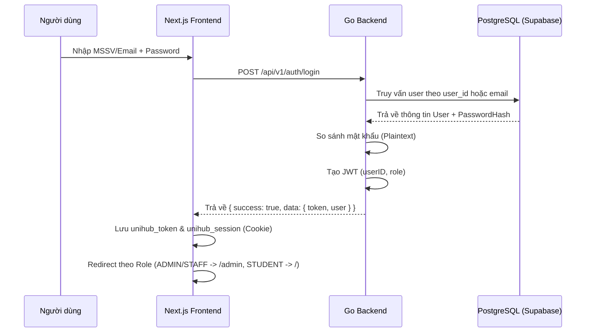

# Tài liệu Luồng Đăng nhập & Bảo mật (Auth Flow)

Tài liệu này ghi lại chi tiết cơ chế đăng nhập, cấp JWT và bảo vệ Route đã được triển khai cho dự án UniHub.

## 1. Luồng hoạt động (Workflow)



## 2. Chi tiết kỹ thuật

### Backend (Go)
- **Endpoint:** `POST /api/v1/auth/login`
- **Logic:** 
  - Tìm kiếm linh hoạt: `SELECT ... WHERE user_id = $1 OR email = $1`.
  - So sánh mật khẩu: Hiện đang dùng so sánh chuỗi trực tiếp (Plaintext).
  - Cấp JWT: Sử dụng thư viện JWT để tạo token có hiệu lực 24h, chứa `userID` và `role`.
- **Cấu trúc Response:**
  ```json
  {
    "success": true,
    "data": {
      "token": "ey...",
      "user": {
        "id": "uuid",
        "student_id": "MSSV",
        "full_name": "...",
        "role": "ADMIN/STAFF/STUDENT"
      }
    }
  }
  ```

### Frontend (Next.js)
- **Lưu trữ Session:** Lưu vào Browser Cookie (`unihub_token`, `unihub_session`) để Middleware có thể đọc được ở phía Server-side.
- **Middleware (Route Guard):**
  - Chặn mọi truy cập vào `/admin` nếu Role không phải là `ADMIN` hoặc `STAFF`.
  - Chặn truy cập vào các trang nội bộ nếu chưa có Token.
  - Tự động chuyển hướng về trang phù hợp nếu người dùng đã đăng nhập mà cố quay lại trang `/login`.

## 3. Các điểm quan trọng (Lưu ý cho Team)
- **Role System:** Hệ thống hiện chỉ chấp nhận 3 vai trò: `ADMIN`, `STAFF`, `STUDENT`. Vai trò `ORGANIZER` cũ đã được loại bỏ/hợp nhất vào `ADMIN`.
- **Case Insensitivity:** Logic kiểm tra Role ở cả Frontend và Middleware đã được sửa để **không phân biệt chữ hoa chữ thường** (tự động chuyển về `.toUpperCase()`).
- **Database Mapping:** Cột MSSV trong DB là `user_id`, trong code Go map vào trường `StudentID`.

## 4. Kế hoạch tiếp theo (To-do)
- [ ] Chuyển đổi mật khẩu sang mã hóa (Bcrypt) khi dự án lên Production.
- [ ] Viết Unit Test cho `AuthService` và `UserRepo`.
- [ ] Xây dựng tính năng "Quên mật khẩu" và "Đổi mật khẩu".
