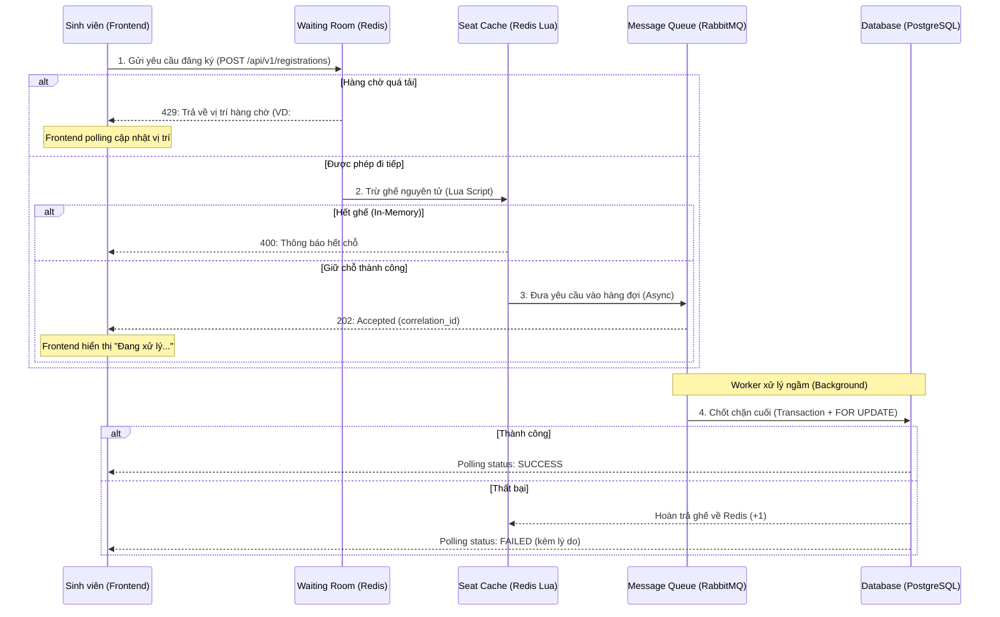

# Đặc tả Luồng Đăng ký Workshop Chịu tải cao (High-Concurrency Registration Flow)

## 1. Tổng quan kiến trúc
Hệ thống được thiết kế theo mô hình **Double-Check Architecture** kết hợp với **Event-Driven Processing** để giải quyết bài toán 12.000 yêu cầu đồng thời, đảm bảo tính nhất quán dữ liệu tuyệt đối (Zero Overbooking) và trải nghiệm người dùng mượt mà.

## 2. Các lớp bảo vệ (Tầng phòng thủ)

### Lớp 1: Virtual Waiting Room (Phòng chờ ảo)
*   **Công nghệ:** Redis Sorted Sets (ZSET).
*   **Cơ chế:** Khi lưu lượng vượt ngưỡng (ví dụ: > 100 req/s), người dùng được đưa vào hàng chờ ảo.
*   **Phản hồi:** Trả về mã HTTP `429 Too Many Requests` kèm theo vị trí hàng chờ (`position`).
*   **UX:** Frontend thực hiện Polling để cập nhật số thứ tự cho sinh viên.

### Lớp 2: Atomic Seat Limiter (Trình giữ chỗ nguyên tử)
*   **Công nghệ:** Redis Lua Scripting.
*   **Cơ chế:** Khi được phép đi tiếp từ phòng chờ, hệ thống thực hiện trừ số lượng ghế trực tiếp trên RAM của Redis.
*   **Tính chất:** Lua Script chạy đơn luồng (Atomic), đảm bảo không xảy ra race condition (hai người cùng chiếm một chỗ cuối).
*   **Dữ liệu:** Lưu trữ key `workshop:seats:{id}`.

### Lớp 3: Asynchronous Enqueuing (Hàng đợi tin nhắn)
*   **Công nghệ:** RabbitMQ.
*   **Cơ chế:** Sau khi đã giữ chỗ tạm thời trên Redis, yêu cầu được đóng gói và gửi vào RabbitMQ.
*   **Phản hồi:** Trả về mã HTTP `202 Accepted` kèm theo `correlation_id`.
*   **Tác dụng:** San phẳng tải (Load Leveling), bảo vệ Database khỏi việc bị quá tải bởi hàng ngàn kết nối đồng thời.

### Lớp 4: Database Consistency (Nhất quán dữ liệu cuối cùng)
*   **Công nghệ:** PostgreSQL với Pessimistic Locking (`SELECT ... FOR UPDATE`).
*   **Cơ chế:** Background Worker tiêu thụ tin nhắn từ RabbitMQ, mở một Transaction và khóa dòng dữ liệu của Workshop đó để kiểm tra lại lần cuối trước khi tạo bản ghi `registrations`.
*   **Rollback:** Nếu Database gặp lỗi hoặc phát hiện dữ liệu sai lệch, ghế sẽ được hoàn trả (increment) lại cho Redis Seat Limiter.

## 3. Sơ đồ trình tự (Sequence Diagram)

## 4. Các trạng thái Đăng ký
1.  **WAITING:** Đang trong phòng chờ ảo (Chưa có ghế).
2.  **PROCESSING:** Đã có ghế tạm thời, đang đợi Worker ghi vào DB.
3.  **SUCCESS:** Đăng ký thành công hoàn toàn.
4.  **FAILED:** Bị từ chối (Hết chỗ thực tế, đã đăng ký trước đó, lỗi hệ thống).

## 5. Quy tắc Thời gian (Timezone)
*   Toàn bộ hệ thống sử dụng múi giờ **Asia/Ho_Chi_Minh (UTC+7)**.
*   Cấu hình đồng nhất tại: `main.go` (`time.Local`), Connection String của Postgres (`timezone=Asia/Ho_Chi_Minh`) và `agent.md`.

---
*Tài liệu này là Nguồn sự thật (Source of Truth) cho mô-đun Đăng ký của UniHub Workshop.*
